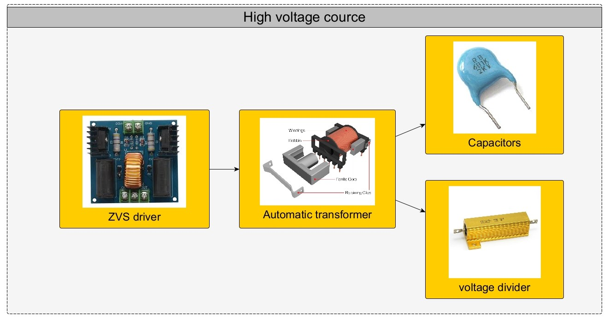
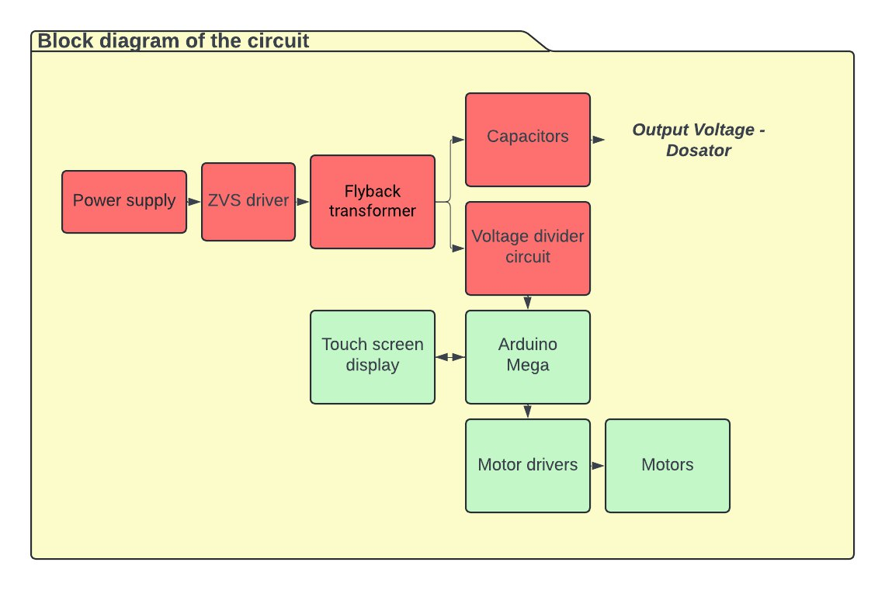

<h1>Electrospinning Device based on Arduino Mega</h1>

This repository contains the source code, hardware schematics, and documentation for a device designed to facilitate the electrospinning process using the Arduino Mega microcontroller. The device allows control and monitoring of various parameters involved in electrospinning, enabling researchers and enthusiasts to experiment with this technique.

<h2>Contents</h2>

<ul>
  <li><a href="#features">Features</a></li>
  <li><a href="#hardware-setup">Hardware Setup</a></li>
  <li><a href="#usage">Usage</a></li>
  <li><a href="#contributing">Contributing</a></li>
  <li><a href="#license">License</a></li>
</ul>

<h2>Features</h2>

The device provides the following features:

<ul>
  <li>Control and monitoring of various parameters involved in the electrospinning process.</li>
  <li>Integration with Arduino Mega microcontroller for easy customization and expansion.</li>
  <li>High voltage source consisting of ZVS driver, flyback transformer, capacitors, and voltage divider for measuring the output voltage.</li>
  <li>ILI9341 screen with touch for user interface.</li>
  <li>2 motors for controlling the electrospinning process.</li>
  <li>L293D driver for regulating the amount that passes through the syringe.</li>
</ul>

<h2>Hardware Setup</h2>

<table>
  <tr>
    <th>
      
The hardware setup consists of the following components:

    </th>
    <th>It works as</th>
  </tr>
  <tr>
    <td>
      <ul>
        <li>ZVS driver</li>
        <li>Flyback transformer</li>
        <li>Capacitors</li>
        <li>Voltage divider</li>
        <li>Arduino Mega microcontroller</li>
        <li>ILI9341 screen with touch</li>
        <li>2 motors</li>
        <li>L293D driver</li>
      </ul>
  </td>
    <td>
      <ul>
        <li><b>The high voltage power supply</b> generates the high voltage needed for the electrospinning process. Its role is to provide a stable and adjustable voltage source to create the electrostatic field required to draw the polymer solution into nanofibers.</li>
        <li><b>The ZVS (Zero Voltage Switching) driver</b> minimizes switching losses in power semiconductor devices by ensuring that switching occurs when the voltage across the switches is close to zero. It works by carefully timing the switching events to coincide with the natural resonant frequency of the circuit, reducing power dissipation and improving efficiency.</li>
        <li><b>The Flyback transformer</b> is used to step up the voltage from the high voltage power supply to the level required for electrospinning. It operates by storing energy in its primary winding during the on-time of the switching cycle and then releasing this energy to the secondary winding during the off-time. This stepped-up voltage is then applied to the electrospinning setup.</li>
        <li><b>The voltage divider</b> is used to measure the output voltage with an Arduino by dividing the high voltage output to a range that is safe for the Arduino's analog input. It consists of two resistors connected in series, with the output voltage taken from the connection between them. This allows the Arduino to accurately measure the high voltage output without damaging itself.</li>
        <li><b>The voltage</b> is applied to the tip of the syringe needle, which contains the polymer solution. This is typically done using a conductive needle connected to the high voltage power supply. When the high voltage is applied, it creates an electrostatic field around the needle, causing the polymer solution to be drawn out in the form of nanofibers.</li>
      </ul>
    </td>
  </tr>
  <tr>
    <td>
      <h3>High voltage schematic</h3>
        
    </td>
    <td>
      <h3>Block diagram of the circuit</h3>
        
    </td>
  </tr>
</table>
<ul>
  <li>See more about <a href="/Hardware/README.md">hardware.</a></li>
  <li>See more about <a href="/Software/UI/README.md">software UI.</a></li>
  <li>See more about <a href="/Software/Electrospining/README.md">softoare board code.</a></li>
</ul>

<h2>Usage</h2>

To use the electrospinning device:

<ol>
  <li>Connect the high voltage source components according to the provided schematics.</li>
  <li>Connect the Arduino Mega to the components and upload the provided source code.</li>
  <li>Use the ILI9341 screen with touch to control and monitor the electrospinning process.</li>
  <li>Adjust the settings as needed and start the electrospinning process.</li>
  <li>Monitor the output and make adjustments as necessary.</li>
</ol>

<h2>Contributing</h2>

Contributions to this project are welcome. Please fork the repository, make your changes, and submit a pull request.

<h2>License</h2>

This project is licensed under the <a href="LICENSE">MIT License</a>.

